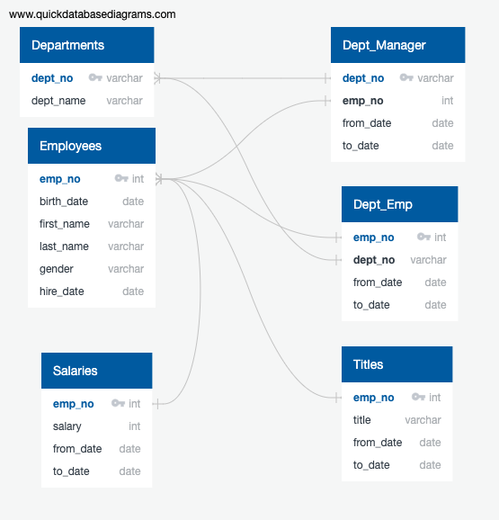

# Pewlett-Hackard-Analysis
## Overview of the Project
Pewlett hackard is a large organization preparing for a potentially sizable portion of their employees retiring. The leadership team wanted to analyze the employee data to better understand the scope of this retirement phase and the potential impacts to the business. For example, many of these retirees would qualify for retirement packages which would have financial impacts. Additionally, their departures would leave behind open positions resulting in a heavy need for recruiting and a large knowledge gap which would likely have cascading impacts throughout the company. The goals of this analysis were to; (1) Determine the number of retiring employees per title, and (2)Identify employees who would be eligible to participate in a mentorship program.

### Resources
employment records for 300,024 employees across six csv files
PostgreSQL and pgAdmin 4

## Analysis
### Overview of the Analysis:
To prepare for this analysis, Entity Relationship Diagrams were created using QuickDBD to sketch out the database framework. This effort included building conceptual diagrams, logical diagrams, and physical diagrams as can be seen in Figure 1. Next, a database was created in PostgreSQL and tables were constructed using SQL queries in pgAdmin 4. Next, the data was analyzed by joining tables, grouping, ordering, and further tailoring the lists to narrow the investigation to the desired results. 

Figure 1. Employee Database Entity Relationship Diagram

### Results:
  * Deliverable 1: The Number of Retiring Employees by Title
From the analysis, it was discovered that 72,458 employees would be up for retirement. As can be seen in Figure 2, the largest volumes of retirees had titles of Senior Engineer (25,916) and Senior Staff (24,926).

Figure 2. The Number of Retiring Employees by Title

  * Deliverable 2: Employees Eligible for the Mentorship Program
To be eligible for a mentorship program, the retirees would be limited to those born between January 1, 1965 and December 3, 1965. After filtering the data, 1549 employees were identified as eligible. The first 10 employees in the list are displayed in Figure 3. 

Figure 3. First 10 from Employees Eligible for the Mentorship Program

          
          
### Summary: 
Deliverable 1: The Number of Retiring Employees by Title
By using SQL the data available was joined, filered, and ordered to identify the number of employees retiring by title as seen in Figure 2 above. In summary, the titles Senior Engineer and Senior Staff will be most impacted. Only two individuals with the title manager were set to retire. In order to better understand the impact of the total number of retiring employees a filter was created to get the total number of current employees (240,124). This means that nearly 30% of the staff at Pewlett-Hackard are preparing to retire. Further investigations should be conducted at the department and title level to determine percentage losses for each group.

Deliverable 2: The Employees Eligible for the Mentorship Program
After filtering on eligibility requirements, it was discovered that 1549 employees would qualify for the program. This equates to 2.1% of the total retiring population. Assuming all these positions are backfilled, this would mean roughly 47 mentees for every 1 mentor. Depending on the level of mentorship expected, this ratio could be difficult to sustain. Further analysis of the job descriptions of those leaving should be investigated for staff strategic planning. Less restrictive mentor criteria should also be investigated to increase the pool of potential mentors. 

